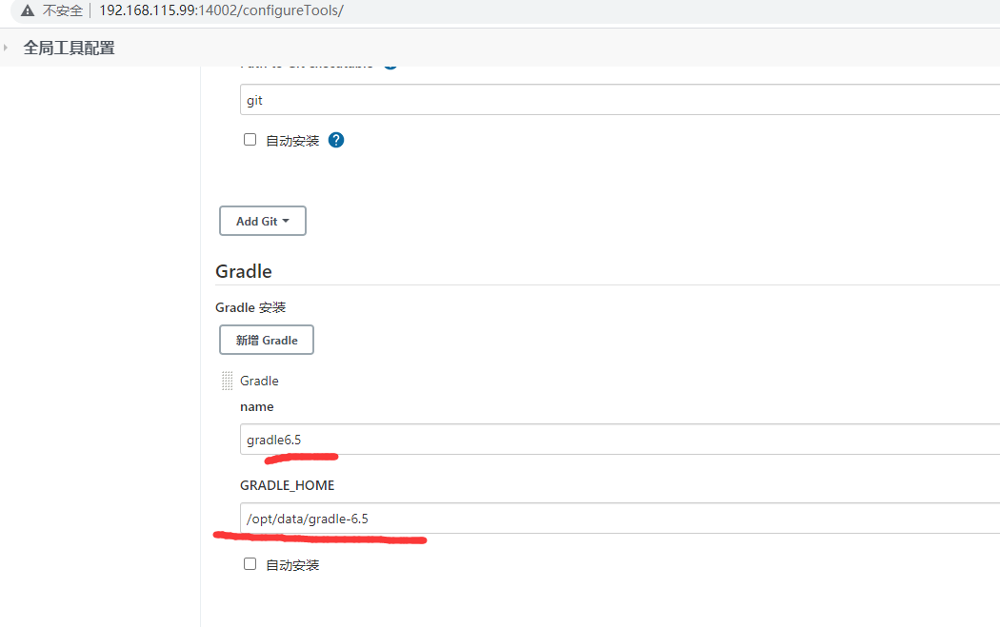
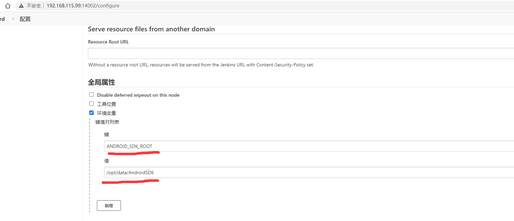

1. 安装Docker并编写DockerCompose

   ```dockerfile
   #docker compose文件如下
   version: "3"
   services:
     jenkins:
       image: "jenkins/jenkins:latest"
       # 需要权限 否则构建的时候报错
       user: root 
       privileged: true
       ports:
         - 14002:8080
         - 14003:50000
       volumes:
         # 宿主机目录:容器内目录
         - /home/dockerdata/jenkinsdata/jh_2.60.3:/var/jenkins_home
         - /home/dockerdata/jenkinsdata/jc_2.60.3:/jenkinsconfig
         - /home/dockerdata/jenkinsdata/ssh:/root/.ssh
         - /home/dockerdata/jenkinsdata/soft:/opt/data
         - /var/run/docker.sock:/var/run/docker.sock
         - /usr/bin/docker:/usr/bin/docker
         - /usr/local/bin/docker-compose:/usr/local/bin/docker-compose
       environment:
         - TZ=Asia/Shanghai
   # 然后docker compose 启动 
   ```


2.打开浏览器输入http://192.168.115.99:14002 并按照提示操作
3.配置Android Gradle 如图

```sh
gradle6.5 命令随意 后面会使用到
此路径是的文件夹在宿主机 
- /home/dockerdata/jenkinsdata/soft:/opt/data
  /opt/data/gradle-6.5
```




4.配置Android SDK 如图



5.编写Jenkinsfile

```shell
node {
   def gradleHome = tool 'gradle6.5'   //这里的gradle6.5要和gradle工具的配置里的name要一致
   env.PATH = "${gradleHome}/bin:${env.PATH}" //把gradle 命令加入环境变量
   stage('git更新') {
   	  //credentialsId 需要拉去代码的凭据
      git branch: 'master', credentialsId: 'c0cae034-4af2-4a6f-acac-a4e58ca61444',url: 'giturl'  }
   stage('gradle') {
      sh '''
      gradle clean
      gradle assembleDevRelease  //核心编译代码
      apkEnv=`find ./ -name *.apk`  //找到编译后的产物
      //上传对应分发平台 给对应人员下载  例如蒲公英等
      curl -F plat_id=1 -F token=x -F file=@${apkEnv}  fileapi
      '''
   }
}

```

